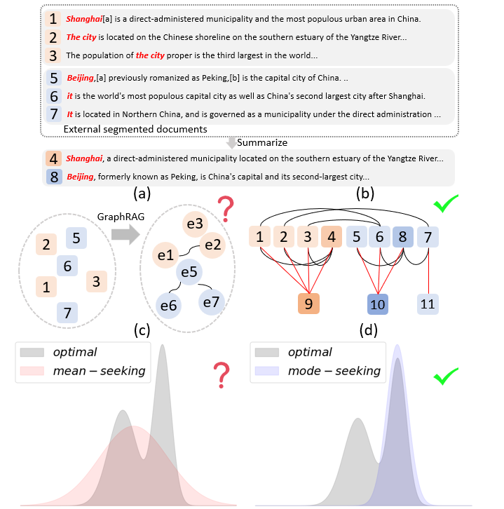

# GraphMPA

## Overview

The official implementation of GraphMPA: 

A Comprehensive Graph Framework for Question Answering with Mode-Seeking Preference Alignment

Traditional RAG face challenges in achieving global understanding and aligning responses with human ethical and quality preferences. To address these issues, we propose GraphMPA, a comprehensive graph-based framework with mode-seeking preference alignment. Our approach constructs a hierarchical document graph using a general similarity measurement, mimicking human cognitive processes for information understanding and synthesis.




## Installation

Before using GraphMPA, ensure Python 3.11+ is installed. 

### Clone the GraphMPA repository:

```bash
git clone https://github.com/tangquanwei/GraphMPA.git
cd raptor
```

### Install necessary dependencies:

Using conda:
```bash
conda create --name graph_mpa python=3.11 -y
conda activate graph_mpa
```

Or using pip:   

```bash
pip install -r requirements.txt
```

## Basic Usage

To get started with GraphMPA, follow these steps:

### Setting Up 

Download model, recommend is here:

LLM: `Qwen/Qwen2.5-7B-Instruct`

Embedding: `BAAI/bge-m3`

### Load model 

Load Embedding model:

```python
from gmpa.embed import STEmbedder
model_path = 'BAAI/bge-m3'
device_map = 'auto'
embedder = STEmbedder(model_path, device_map)
```

Load Language model:

```python
from gmpa.llm import HF_LLM
model_path = 'Qwen/Qwen2.5-7B-Instruct'
device_map = 'auto'
llm = HF_LLM(model_path, device_map)
```

Build RAG Object:

```python
from gmpa import Rag
rag = Rag(embedder, llm)
```

Load Data:

```python
path = "data/The Great Gatsby.txt"
with open(path, encoding='latin-1') as f:
    text = f.read()
len(text)
```

Construct Database:

```Python
rag.build(
    document=text,
    chinese=True,
    enable_large_chunk_summary=True,
)
```

Sample Question Retrieve:

```Python
question="What is the main content of this book?"
context=rag.retrive(question)
print(context)
```

Make a prompt:

```Python
promplate="""Given the Question, Context below, provide a logical reasoning to get the answer. Please use the format of: ##Reason: <reason> ##Answer: <answer>.

Question: {question}

Context: {context}"""
prompt=promplate.format(question=question, context=context)
print(prompt)
```

Answer Question:

```Python
answer=llm.answer_question(prompt)
print(answer)
```

## Contributing

GraphMPA is an open-source project, and contributions are warmly welcomed. Whether you're fixing bugs, implementing new features, or enhancing the documentation, your efforts are greatly appreciated.

## Citing

If you find our paper or this repository helpful, please consider citing our work – it’s much appreciated! 😊
